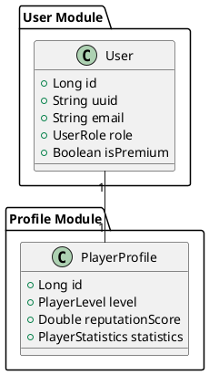
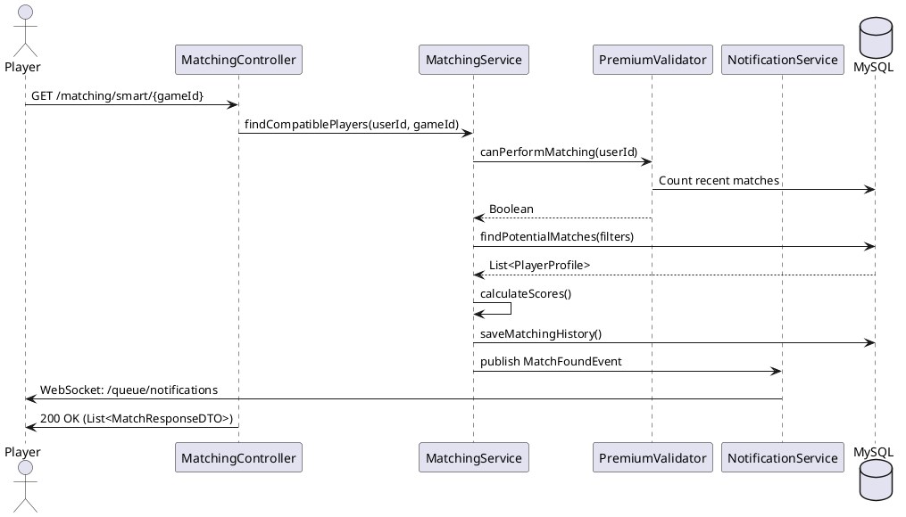
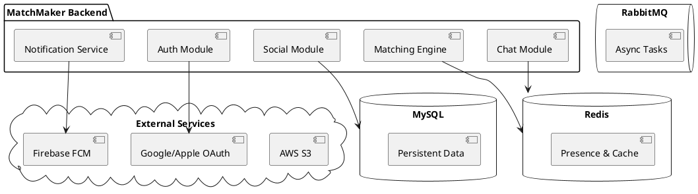
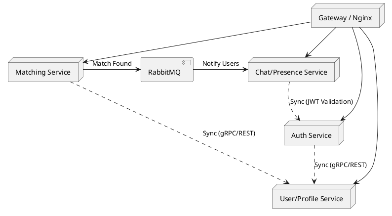

# Diagrammes UML - MatchMaker Gaming

## 1. Diagramme de Classes Global (Extrait)

## 2. Diagramme de Séquence : Flux de Matchmaking Intelligent

## 3. Diagramme de Composants (Architecture Modulaire)

## 4. Architecture Cible (Microservices Ready)

